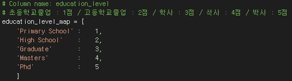
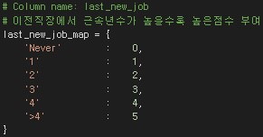
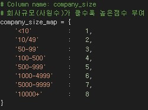
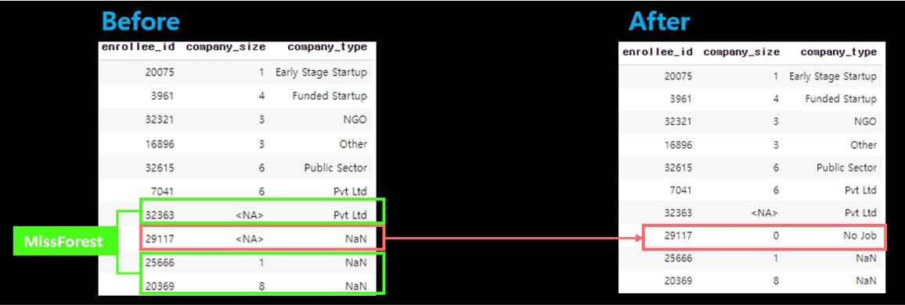
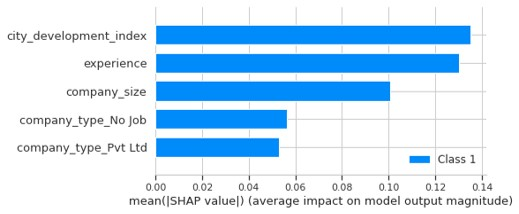

## **HR Analytics / Data Scientist Turnover Trend**
## (Ver.Amendment)
 

### **개선 된 프로젝트**
해당 프로젝트는 이전 프로젝트(ver.Draft)의 개선된 버전으로, 결측치처리, 불균형데이터처리, 평가지표 선정 등 다방면에서 업데이트를 진행 

 

#### 파일 설명
    HR_Analytics_Data_Scientist_Turnover_Trend_Ver_Amendment : 데이터 분석 진행 파일
    requirements_Amendment : 작업에 사용된 라이브러리 버전 모음
    images : README 첨부 사진
 

### **사용한 데이터**
https://www.kaggle.com/datasets/arashnic/hr-analytics-job-change-of-data-scientists 
현·예비 데이터 직군 종사자들의 배경환경과 이직희망 여부를 기록한 데이터셋
  
Data preview
1. Surveyor columns 

   >   
       * enrollee_id - 설문자 고유번호
       * gender - 설문자 성별
       * target - 이직희망여부
         (0 = 비희망 / 1 = 희망)

2. Knowledge columns 

   >   
       * education_level - 학위
         ('Phd',　'Masters',　'Graduate',　'High School',　'Primary School',　nan )
       * major_discipline - 전공
         ('STEM',　'Business Degree',　'Humanities',　'Arts',　'Other',　'No Major',　nan)
       * training_hours - 교육시간
         (1~336_Continuous Data)
       * relevent_experience - 데이터직군 관련경험
         ('Has relevent experience',　'No relevent experience')
       * experience - 경력년수
         (1~21_Continuous Data / <1, >20, nan)
       * last_new_job - 이전직장 근속년수
         (Never,　1,　2,　3,　4,　>4 / nan)

3. City columns 

   >   
       * city - 도시 고유 번호
       * city_development_index - 도시 개발 지수
         (0.448~0.949_Continuous Data) 

4. Company columns 

   >   
       * company_type - 회사 유형
         ('Pvt Ltd',　'Funded Startup',　'Early Stage Startup',　'Public Sector',　'NGO',　'Other',　nan)
       * company_size - 회사 규모(사내 직원수)
         (<10,　10-49,　50-99,　100-500,　500-999,　1000-4999,　5000-9999,　10000<,　nan)
  
 

### **분석 목표**
데이터 직군에 종사하는 사람들의 배경에 좌우되는 이직희망여부를 통해 이진분류 모델 설계 및 이직트렌드를 분석하여 데이터직군 종사자들에게 이직 트렌드를 시사하고, 채용하는 회사에게 퇴직자를 예상하여 대비할 수 있게 한다.
  

### **가설 설정**
－ 직군 종사 년차가 낮을경우 이직률이 높다. 
　　(주니어레벨의 경우 1-3년 이내 이직률이 높다고 하는데, 실제로도 이러한 현상이 드러나는지 확인) 
－ 도시개발지수(인프라)가 낮을수록 이직률이 높다. 
　　(미국의 실리콘밸리, 한국의 판교처럼 앙질의 인프라가 갖춰진 도시가 아닐수록 이직률이 높은지 확인.)
 
 

### **분석 진행 방향**
**1. 데이터 전처리** 
　- 1.1 데이터 현황 파악 
　- 1.2 데이터 미리보기 
　- 1.3 순서형변수 인코딩 
　- 1.4 이상치 처리 
　- 1.5 결측값 처리(다른 특성으로 유추) 
　- 1.6 결측값 처리(유추 불가 특성) 
　- 1.7 기계학습을 통한 결측값 처리(순서형변수) 
　- 1.8 기계학습을 통한 결측값 처리(명목형) 
　- 1.9 데이터 재구성 

**2. 데이터 균형화 **
　- 2.1 데이터 분할 
　- 2.2 Oversampling 기법 적용 

**3. 이진분류 모델 설계 **
　- 3.1 기준모델 정의 
　- 3.2 사용모델 설명 
　- 3.3 생성모델 성능비교 
　- 3.4 최종모델 선정 

**4. 모델 분석 결과 **

**5. 이전 프로젝트 대비 개선사항  **

### **1. 탐색적 데이터분석**

 

#### **1.1　데이터 현황 파악**
>   
－ 'city'는 도시의 고유명이기에 High cardinality 현상 관측 
－ 'enrollee_id'는 종사자의 고유명이기에 unique현상 관측
 
－ 'target' 비율이 불균형하여 Zeros현상 관측(0 : 72% / 1 : 28% 
－ "gender", "education_level", "major_discipline" 등 6개특성 결측치(Missing) 보유 

 

#### **1.2　데이터 미리보기** 
데이터를 구성하는 특성을 세부류로 나누어 동향 확인 및 특성별 결측치 확인

 

> **1) 인적자료(성별/학력)** 
－ 인적자료(성별/학력)에 속하는 특성과 이직희망여부의 관계성 추론  
 

 

> **2) 인적자료(경험)** 
－ 인적자료(경험)에 속하는 특성과 이직희망여부의 관계성 추론  
 

 

> **3) 물적자료(인프라/회사)** 
－ 물적자료(인프라/회사)에 속하는 특성과 이직희망여부의 관계성 추론  
 

 

> **4) 특성별 결측값 비율** 
－ 특성별 결측치 비율을 확인 및 대치계획 수립
 
 1)  **결측값이 있는 수치형변수** 
　- 없음 
2) **결측값이 있는 Ordinal범주형변수(순위를 측정할 수 있는 변수)** 
　- education_level,　experience,　last_new_job,　company_size 
**3) 결측값이 있는 Nominal범주형변수(순위를 측정할 수 없는 변수)** 
　- gender,　major_discipline,　company_type  
**Missing Value Handling Plan :** 
변수(특성)의 성질에 따라 적합한 대치법 활용_(다른 특성으로 유추, 머신러닝모델 활용, 단일값대치)

 

#### **1.3　순서형변수 인코딩** 
결측값 처리 이전 채용·구직환경시장에서 일반적으로 순위를 측정할 수 있는 특성들에 한해 Mapping을 통한 Encoding 
>  
> **1) education_level** 
 
**(초등학교졸업 : 1점 / 고등학교졸업 : 2점 / 학사 : 3점 / 석사 : 4점 / 박사 : 5점)**   
> **2) experience** 
 
**경험년차가 높을수록 높은점수 부여**  
> **3) last_new_job** 
 
**이전직장에서 근속년수가 높을수록 높은점수 부여**  
> **4) company_size** 
 
**회사규모(사원수)가 클수록 높은점수 부여**  
> **5) relevent_experience** 
 
**(경험없음 : 0점 / 경험있음 : 1점)** 
boolean으로 분류할 수 있으나, 경험보유는구직시 메리트로 적용됨으로 경험 여부를 차등화
 

 

#### **1.4　이상치 처리** 
결측치 대치 소요를 줄이기 위해 교육시간(training_hours)에 대한 이상치삭제
>
 

 

#### **1.5 결측값 처리(다른 특성으로 유추)** 
연관성이 있을것으로 예상되는 특성들을 묶어 유추하는 방법의 대치
> **1) major_discipline & education_level** 
－ 학력(education_level)이 고등학교졸업(2) 미만일 경우 major_discipline(전공)이 없을 것이라 추측 
  
 － 실제로 전공특성의 모든 결측치(붉은색)가 고등학교 미만 학력에서 검출. 해당부문 결측치'No Major' 할당 
 － 학력과 전공이 모두 결측치(보라색)일 경우 유추가 불가능하기에 해당 열 삭제  
 
  
>**2) company_size & company_type** 
－ 회사규모(company_size), 회사유형(company_type) 모두 결측값(0, NaN)일 경우 미취업자로 판단하여 'No job' 할당 
  
－ 한개 특성만 NaN일경우 추후 머신러닝모델(Missforest)을 활용하여 대치 (이후 기술)  

 

#### **1.6 결측값 처리(유추 불가 특성)**
성별(gender)의 경우 다른 특성으로 유추할 수 없다고 판단 
>  
－ cardinality가 3개로, 다른 특성에 비해 다양하지 않기에, 모델학습에서 중요한 특성으로 인식될 경우 오 예측을 야기할 것이라 예상 / 따라서 'No Data'로 일괄대치
  

 

#### **1.7 기계학습을 통한 결측값 처리(순서형)**
채용·구직환경에서 일반적으로 순위를 측정할 수 있는 특성 중 결측치 처리가 되지 않은 행에 대하여 MissForest를 통한 기계학습 대치 진행 
>  
－ RandomForest-Algorithm을 기반으로한 Missforest를 통해 다른 특성들과의 관계를 계산하여 결측치를 대치  
 
－ 순서형 변수에 대한 결측치처리 완료 

 

#### **1.8 기계학습을 통한 결측값 처리(명목형)**
채용·구직환경에서 일반적으로 순위를 측정할 수 없는 특성 중 결측치 처리가 되지 않은 행에 대하여 MissForest를 통한 기계학습 대치 진행 
>  
－ RandomForest-Algorithm을 기반으로한 Missforest를 통해 다른 특성들과의 관계를 계산하여 결측치를 대치  
 
－ 명목형 변수에 대한 결측치처리 완료 

 

#### **1.9 데이터 재구성**
결측치 제거 완료 후 학습 / 검증 데이터로 변환 이전 데이터 재구성 
>  
－ unique값 index로 전환_(enrollee_id) 
－ 같은 값을 표기(1:1 매칭)하는 특성 삭제_(city) 
－ 명목형 특성 OneHot-Encoding(gender, major_discipline, company_tyle)  
**최종 17743 레코드 X 25개 속성 형태** 
(범주형 → 성별 : 4종 / 전공 : 6종 / 회사유형 : 7종) + (수치형 / 순서형 → 이외 10개 특성)

 

### **2. 데이터 균형화** 
기계학습 이전 학습,테스트데이터를 형성하고, 이직 희망자와 비희망자의 분포가 불균형한 데이터임을 확인하여 양질의 기계학습을 위한 증폭을 진행

 

#### **2.1 데이터 분할**
> 머신러닝 모델에 사용할 학습데이터와 테스트데이터를 80% : 20% 비율로 분할  
  
분할된 데이터 양상 비교
 
**학습용 데이터와 테스트용 데이터 셋의 양상이 흡사하게 나뉘어진 모습**
 

 

#### **2.2 Oversampling 기법 적용** 
불균형한 데이터를 해소하기 위해 4개의 증폭기법(SMOTE, ADASYN, SMOTE-Tomek, SMOTE-ENN)적용  
> **1) Basic Data** 
 

 

> **2) SMOTE Oversampling Data** 
 
－ 데이터 증폭 적용 후 시각화 결과 균형이 맞춰짐을 확인

 

> **3) ADASYN Oversampling Data** 
 
－ 데이터 증폭 적용 후 시각화 결과 균형이 맞춰졌으며, 알고리즘 특성상 이직희망자(1)의 샘플이 더 생성된 모습

 

> **4) SMOTE-Tomek Oversampling Data** 
 
－ 데이터 증폭 적용 후 시각화 결과 균형이 맞춰졌으며, 복합 sampling 알고리즘 특성상 전체 데이터 갯수는 단순 증폭 알고리즘보다 감소한 모습 

 

> **5) SMOTE-ENN Oversampling Data** 
 
－ 데이터 증폭을 적용하였으나, 복합 sampling 알고리즘 특성상 데이터가 많았던 '이직비희망자'는 감소하고 '이직희망자'가 증가하여 형세가 뒤집힌 모습

 

> **6) Check All Data** 
 
－ 증폭 알고리즘 적용 전후 target의 갯수를 시각화한 결과 SMOTE-ENN을 제외한 모든 기법에서 표본증가 및 imbalanced 이슈 해소 완료

 

### **3. 이진분류 모델 설계 **
평가지표를 선정, 데이터 증폭 알고리즘별 분류모델 생성 후 최우수 모델에 대한 파라미터 튜닝 진행 
 

#### **3.1 기준모델 정의** 

> **1) Accracy BaseLine** 
 

 

> **2) AUPRC** 
 

 

#### **3.2 사용모델 설명**
데이터별 생성할 RandomForest, XGBoost 모델에 대한 설명 
> **1) 모델 설명** 
 
－ RandomeForest : 개인분석 후 취합하여 결과도출 
－ XGBoost : 지속 개선 후 결과도출  
**2) 모델 생성시 제약조건** 
 
－ 과소, 과대적합 방지가 일어나지 않는 선에서 파라미터를 지정하여 동등한 조건 내 성능을 비교하기 위해 제약조건 적용 

 

#### **3.3 생성모델 성능비교**  
> **10개모델 성능 비교** 
 
 
 
－ 모든 모델이 Accuracy BaseLine을 통과 
－ 모든 모델이 AUPRC BaseLine을 통과 
－ 최고 정확도가 동일하나, AUPRC면에서 상대적 우위를 보인 SMOTE RF모델에 대하여 튜닝 진행  

 

#### **3.4 최종모델 선정**  
> **Hyperparameter Tunning 이후 기존 모델과 성능비교** 
 
 
－ 파라미터 조정 이후 Accuracy, AUPRC 증가  
**“SMOTE Data로 학습이후 Parameter Tuning을 거친 Random Forest Model”을 “데이터 직군의 이직여부를 판단하는 최종모델＂로 선정** 

 

### **4. 모델 분석 결과 **
> **1) 특성중요도 순위**  
 
－ 최종모델이 이직여부를 분류할때 참고한 주요 특성은 도시개발지수(CDI), 경력년수(experience), 회사규모_회사에 종사중인 사원수(company_size) 이하 순  
－ 최초 가설로 설정한 도시개발지수와 경력년수가 상위권에 위치함을 인지

 

> **2) 이직희망여부에 대한 도시개발지수의 영향**  
 
－ 도시 개발지수가 0.624미만인 곳에 종사하는 사람들의 이직희망율이 양수의 영역에서 도식  
－ 이후 지수가 커질수록 이직 희망률이 감소하는 추세  
－ 감소추세를 이어나가는 도중 지수가 0.91~0.92구간에서 이직희망률이 간헐적으로 증가 후 재 감소 

 

> **3) 이직희망여부에 대한 경험년차의 영향** 
  
－ 직종경험년차가 2년차까지 이직 희망률이 증가추세이며, 3년차 까지는 양수의 영역으로 비교적 높음을 관측   
－ 연차가 5년 이상일때 음수의 영역에서 기울기의 큰 변화가 없으므로 이직자와 이직비희망자의 비율이 지속적으로 유사  
－ 이를통해 1-3년차의 주니어 분석가들의 이직률이 높고, 이후 안정추세를 찾아가는것으로 추측이 가능 

 

> **4) 이직트렌드 분석 결과** 
가설에 주제가 되고 특성중요도에서도 상위를 차지했던 도시개발지수와 경험년차를 이직희망여부와 동시 도식 
  
－ 지수가 비교적 낮은 위치에 있는 0.624를 기점으로 이직희망률이 높았으며, 경력이 2년차일때 이직희망률이 높아짐을 관측  
－ 이후 도시개발지수 측면에서 특정구역(0.91~0.92)의 이직희망률이 증가하였고, 경험년차 측면에선 20년차 이상일때 이직희망률이 최대치를 갱신하였다.  
> * 20년차 초과의 경력자의 경우 1년단위가 아닌 “20년차 이상”으로 집계되었기에 표본의 수가 가장 많음  
> * 위와 더불어 퇴직의 경우에도 이직희망에 포함되어 집계되었을 것이라 가정한다면, "개발지수가 0.91-0.92이고, 경력이 20년차 초과"하는 경우는 "좋은 인프라를 누리는 프로 수준의 종사자들이 퇴직"을 하는 사례임에도 이직 희망률로 비춰질 수 있다고 추측

>

 

### **5. 이전 프로젝트 대비 개선사항** 
> **1) 시각화의 품질향상** 
> - bar chart에 국한되었던 Draft Version에 비해 다양한 chart 도식 및 인포그래픽 형식의 도표 삽입을 시행하여 전문적인 시각화자료를 확보할 수 있었다. 

 

> **2) 결측치처리 방법의 세분화** 
> - 결측치를 처리한다는 명목 하 겉보기에만 다른값('No Data')으로 일괄대치했던 이전 프로젝트 대비, "다른특성으로 유추", "기계학습을 활용한 대치"를 도입하여 보다 영양가 있는 데이터 확보가 가능했다. 

>
> * 평가지표를 ROC AUC Score로 동일 시 하더라도, 동일조건_(SMOTE로 증폭하고 XGBoost를 활용) 내 파라미터 및 임계값 조정을 한 모델보다, 결측치 처리만 구체적으로 진행한 현 Version의 XGBoost모델의 ROC AUC Score가 높았다. 
(결측치 처리만으로 성능이 향상되었다고 볼 수 있다.)

 

>**3) 다양한 증폭 알고리즘 도입** 
> - 단순히 대중적이란 이유로 SMOTE 증폭 알고리즘 사용에 그쳤던 Draft Version과 달리, 보다 다양한 Over Sampling, Combining Sampling을 활용하며 개념학습 및 다양한 방법론의 존재를 인지할 수 있었다.

 

>**4) 평가지표 재선정** 
> - 주제의 특징을 보다 잘 반영할 수 있는 평가지표(AUPRC)를 선정하는 과정 속, 상황에 따라 평가지표의 적합성이 달라짐을 체득할 수 있었다.