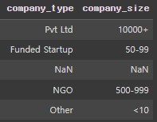
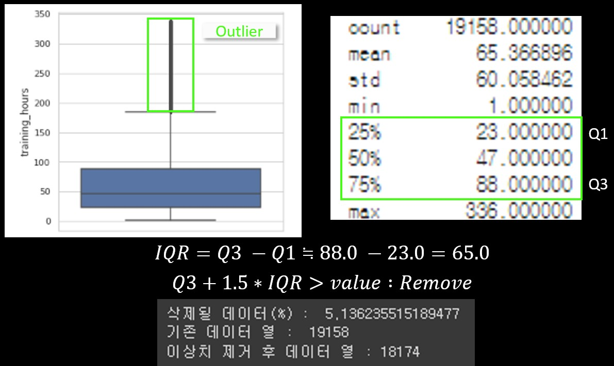
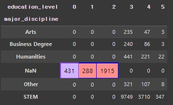

## **HR Analytics / Data Scientist Turnover Trend**
## (Ver.Amendment)
 

### **개선 된 프로젝트**
해당 프로젝트는 이전 프로젝트의 개선된 버전으로, 결측치처리, 불균형데이터처리 등 방법론에 관한 업데이트를 진행 

－ 이전 프로젝트 링크 
https://github.com/ByoungChan-Park/PJ2_Group-of-BigData-Job-Turnover-Trend/tree/main/Analytics_ver.Draft 
  

#### 파일 설명
    HR_Analytics_Data_Scientist_Turnover_Trend_Ver_Amendment : 데이터 분석 진행 파일
    requirements : 작업에 사용된 라이브러리 버전 모음
    images : README 첨부 사진
 

### **사용한 데이터**
https://www.kaggle.com/datasets/arashnic/hr-analytics-job-change-of-data-scientists 
데이터 직군에 종사중인 사람들의 배경환경과 이직희망 여부를 기록한 데이터셋
  
Data preview
1. Surveyor columns 

   >   
       * enrollee_id - 설문자 고유번호
       * gender - 설문자 성별
       * target - 이직희망여부
         (0 = 비희망 / 1 = 희망)

2. Knowledge columns 

   >   
       * enrolled_university - 대학 진학 과정
         ('Full time course',　'Part time course',　'no_enrollment',　nan)
       * education_level - 학위
         ('Phd',　'Masters',　'Graduate',　'High School',　'Primary School',　nan )
       * major_discipline - 전공
         ('STEM',　'Business Degree',　'Humanities',　'Arts',　'Other',　'No Major',　nan)
       * training_hours - 교육시간
         (1~336_Continuous Data)
       * relevent_experience - 데이터직군 관련경험
         ('Has relevent experience',　'No relevent experience')
       * experience - 경력년수
         (0~21_Continuous Data / nan)
       * last_new_job - 이전직장 근속년수
         (Never,　1,　2,　3,　4,　>4 / nan)

3. City columns 

   >   
       * city - 도시 고유 번호
       * city_development_index - 도시 개발 지수
         (0.448~0.949_Continuous Data) 

4. Company columns 

   >   
       * ompany_type - 회사 유형
         ('Pvt Ltd',　'Funded Startup',　'Early Stage Startup',　'Public Sector',　'NGO',　'Other',　nan)
       * company_size - 회사 규모(사내 직원수)
         (<10,　10-49,　50-99,　100-500,　500-999,　1000-4999,　5000-9999,　10000<,　nan)
  
 

### **분석 목표**
데이터 직군에 종사하는 사람들의 배경에 좌우되는 이직희망여부를 통해 이진분류 모델 설계 및 이직트렌드를 분석하여 데이터직군 종사자들에게 이직 트렌드를 시사하고, 채용하는 회사에게 퇴직자를 예상하여 대비할 수 있게 한다.
  

### **가설 설정**
－ 직군 종사 년차가 낮을경우 이직률이 높다. 
　　(주니어레벨의 경우 1-3년 이내 이직률이 높다고 하는데, 실제로도 이러한 현상이 드러나는지 확인) 
－ 도시개발지수(인프라)가 낮을수록 이직률이 높다. 
　　(미국의 실리콘밸리, 한국의 판교처럼 앙질의 인프라가 갖춰진 도시가 아닐수 록 이직률이 높은지 확인.)
 
 

### **분석 진행 방향**
**1. 데이터 전처리** 
　- 1.1 데이터 현황 파악 
　- 1.2 순서형변수 인코딩 
　- 1.3 이상치 처리 
　- 1.4 결측값 처리(다른 특성으로 유추) 
　- 1.5 결측값 처리(유추 불가 특성) 
　- 1.6 결측값 처리(순서형변수) 
　- 1.7 결측값 처리(명목형) 

**2. 데이터 균형화 **
　- 2.1 데이터 분할 
　- 2.2 Oversampling 기법 적용 
　- 2.3 균형화 확인 

**3. 이진분류 모델 설계 **

**4. 결론 도출  **

### **1. 데이터 전처리 **

#### **1.1　데이터 현황 파악**
>   
－ 'city'는 도시의 고유명이기에 High cardinality 현상 관측 
－ 'enrollee_id'는 설문자의 고유명이기에 unique현상 관측
 
－ 'target' 비율이 불균형하여 Zeros현상 관측(0 : 72% / 1 : 28% 
－ "gender", "major_discipline", "company_type", "company_size"를 제외하고 특성별10%미만의 결측치(Missing) 보유  

>   
－ 학위(education_level),　경험년차(experience),　이전직장근속년수(last_new_job)　,직종관련경험(relevent_experience), 
　 도시개발지수(city_development_index　,회사규모(company_size)에서 이직희망여부와 관계성 추론  

>  
 1)  **결측값이 있는 수치형변수** 
　- 없음 2) **결측값이 있는 Ordinal범주형변수(순위를 측정할 수 있는 변수)** 
　- education_level,　enrolled_university,　experience,　last_new_job,　company_size **3) 결측값이 있는 Nominal범주형변수(순위를 측정할 수 없는 변수)** 
　- gender,　major_discipline,　company_type  **Missing Value Handling Plan :** 
변수(특성)의 성질에 따라 적합한 대치법 활용_(다른 특성으로 유추, 머신러닝모델 활용, 단일값대치)
 

 

#### **1.2　순서형변수 인코딩**
> 결측값 처리 이전 채용·구직환경시장에서 일반적으로 순위를 측정할 수 있는 특성들에 한해 Mapping을 통한 Encoding 
> **1) education_level** 
 
**(초등학교졸업 : 0점 / 고등학교졸업 : 1점 / 학사 : 2점 / 석사 : 3점 / 박사 : 4점)**   
> **2) enrolled_university** 
 
**(미진학 : 0점 / 야간대학과정 : 1점 / 정규대학과정 : 2점)**  
> **3) experience** 
 
**경험년차가 높을수록 높은점수 부여**  
> **4) last_new_job** 
 
**이전직장에서 근속년수가 높을수록 높은점수 부여**  
> **5) company_size** 
 
**회사규모(사원수)가 클수록 높은점수 부여**  
> **6) relevent_experience** 
 
**boolean으로 분류할 수 있으나, 경험보유는구직시 메리트로 적용됨으로 경험 여부를 차등화** 
(경험없음 : 0점 / 경험있음 : 1점)
 

 

#### **1.3　이상치 처리**
> 결측치 대치 소요를 줄이기 위해 교육시간(training_hours)에 대한 이상치삭제

 

 

#### **1.4결측값 처리(다른 특성으로 유추)**
> － 학력(education_level)이 고등학교졸업(1) 미만일 경우 major_discipline(전공)이 없었기에 'No Major' 할당 
  
>－ 회사규모(company_size), 회사유형(company_type) 모두 결측값(0, NaN)일 경우 미취업자로 판단하여 'No job' 할당 
 
한개 특성만 NaN일경우 추후 머신러닝모델(Missforest)을 활용하여 대치
 

 

#### **1.5　결측값 처리(유추 불가 특성)**
> － 성별(gender)의 경우 다른 특성으로 유추할 수 없다고 판단 
－ 1.1의 데이터 현황-"Feature에 따른 이직희망률" 자료상 성별이 target에 주는 영향은 미미했으며, 　 영향이 있다고 하더라도 카테고리가 다양하지 않아 오 예측을 야기를 방지하기 위해 'No Data'로 일괄 대치  

 

 

#### **1.7 결측값 처리(명목형)**
> － 채용·구직환경에서 일반적으로 순위를 측정할 수 없는 특성에 대한 결측치 처리 
[회사유형(company_type)]　 
－ 대부분의 결측치가 처리 된 이후 명목형 변수에 대한 처리를 실시하여 정확한 분류 유도
－ RandomForest-Algorithm을 기반으로한 Missforest를 활용해 
　 다른 특성들과의 관계를 계산하여 결측치를 대치
  
－ 명목형 변수에 대한 결측치처리 완료 

 

 

### **2. 데이터 균형화 **
 

#### **2.1 데이터 분할**
> 머신러닝 모델에 사용할 학습데이터와 테스트데이터를 80% : 20% 비율로 분할  
  
분할된 데이터 양상 비교
 
**학습용 데이터와 테스트용 데이터 셋의 양상이 흡사하게 나뉘어진 모습**
 

 

#### **2.2 Oversampling 기법 적용**
> 불균형한 데이터를 해소하기 위해 4개의 증폭기법(SMOTE, ADASYN, SMOTE-Tomek, SMOTE-ENN)적용  
 
**증폭 알고리즘별 학습데이터의 target count결과 UnderSampling과정인 SMOTE-ENN 외 균형화 완료**
 

 

### **3. 이진분류 모델 설계 **
 

#### **3.1 기준모델 정의**
> target이 28:72 비율로 나타나는 기본 데이터셋은 모든 예측을 0(이직 비희망)으로 하더라도,  72%의 정확도가 나오기에 72% 이상의 정확도를 목표  
  
 

 

#### **3.2 생성모델 성능 비교**
> BasicData와 증폭알고리즘별 RF, XGB모델을 만들어 10개의 모델 성능 비교  
  
> 평가지표를 구체적으로 확인하기 위해 모델별 Confusion Matrix 확인 
  
> 하이퍼파라미터 튜닝모델 성능비교 

 

 

### **4. 모델 분석 결과 **
> 특성중요도 확인  
  
> 이직희망여부에 대한 근속년차의 영향 
  
> 이직희망여부에 대한 도시개발지수의 영향 

  
> 이직희망여부에 대한 회사규모의 영향 

