## **HR Analytics / Data Scientist Turnover Trend**
## (Ver.Draft) 
 

#### 파일 설명
    HR_Analytics_Data_Scientist_Turnover_Trend_Ver_Draft : 데이터 분석 진행 파일
    requirements : 작업에 사용된 라이브러리 버전 모음
    images : README 첨부 사진
 

### **사용한 데이터**
https://www.kaggle.com/datasets/arashnic/hr-analytics-job-change-of-data-scientists 
현·예비 데이터 직군 종사자들의 배경환경과 이직희망 여부를 기록한 데이터셋
  
Data preview
1. Surveyor columns 
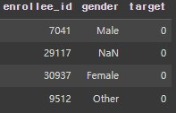
   >   
       * enrollee_id - 설문자 고유번호
       * gender - 설문자 성별
       * target - 이직희망여부
         (0 = 비희망 / 1 = 희망)

2. Knowledge columns 
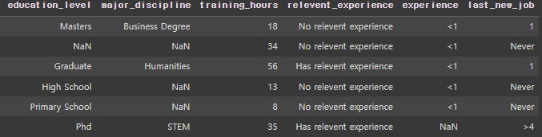
   >   
       * education_level - 학위
         ('Phd',　'Masters',　'Graduate',　'High School',　'Primary School',　nan )
       * major_discipline - 전공
         ('STEM',　'Business Degree',　'Humanities',　'Arts',　'Other',　'No Major',　nan)
       * training_hours - 교육시간
         (1~336_Continuous Data)
       * relevent_experience - 데이터직군 관련경험
         ('Has relevent experience',　'No relevent experience')
       * experience - 경력년수
         (1~21_Continuous Data / <1, >20, nan)
       * last_new_job - 이전직장 근속년수
         (Never,　1,　2,　3,　4,　>4 / nan)

3. City columns 
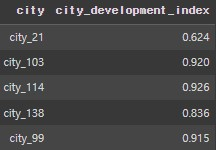
   >   
       * city - 도시 고유 번호
       * city_development_index - 도시 개발 지수
         (0.448~0.949_Continuous Data) 

4. Company columns 
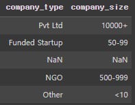
   >   
       * company_type - 회사 유형
         ('Pvt Ltd',　'Funded Startup',　'Early Stage Startup',　'Public Sector',　'NGO',　'Other',　nan)
       * company_size - 회사 규모(사내 직원수)
         (<10,　10-49,　50-99,　100-500,　500-999,　1000-4999,　5000-9999,　10000<,　nan)
  
 

### **분석 목표**
데이터 직군에 종사하는 사람들의 배경에 좌우되는 이직희망여부를 통해 이진분류 모델 설계 및 이직트렌드를 분석하여 데이터직군 종사자들에게 이직 트렌드를 시사하고, 채용하는 회사에게 퇴직자를 예상하여 대비할 수 있게 한다.
  

### **가설 설정**
－ 직군 종사 년차가 낮을경우 이직률이 높다. 
　　(주니어레벨의 경우 1-3년 이내 이직률이 높다고 하는데, 실제로도 이러한 현상이 드러나는지 확인) 
－ 도시개발지수(인프라)가 낮을수록 이직률이 높다. 
　　(미국의 실리콘밸리, 한국의 판교처럼 앙질의 인프라가 갖춰진 도시가 아닐수 록 이직률이 높은지 확인.)
 
 

### **분석 진행 방향**
**1. 탐색적 데이터분석** 
　- 1.1 데이터 현황 파악 
　- 1.2 특성공학 / 결측치처리 
　- 1.3 레이블 인코딩 

**2. 데이터 균형화 **
　- 2.1 데이터 분할 
　- 2.2 Oversampling 기법 적용 

**3. 이진분류 모델 설계 **
　- 3.1 기준모델 정의 
　- 3.2 생성모델 성능비교 

**4. 모델 분석 결과  **

### **1. 탐색적 데이터분석 **

#### **1.1　데이터 현황 파악**
>  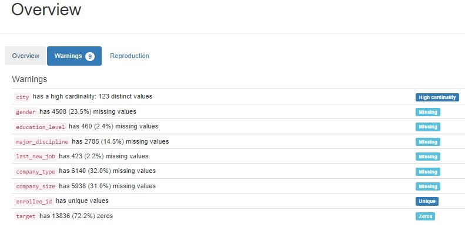 
－ 'city'는 도시의 고유명이기에 High cardinality 현상 관측 
－ 'enrollee_id'는 종사자의 고유명이기에 unique현상 관측
 
－ 'target' 비율이 불균형하여 Zeros현상 관측(0 : 72% / 1 : 28% 
－ "gender", "education_level", "major_discipline" 등 6개특성 결측치(Missing) 보유  

 

#### **1.2　특성공학 / 결측치처리**
특성공학을 진행하며 결측치가 있는경우 대치를 진행. 

> **1) enrollee_id**  
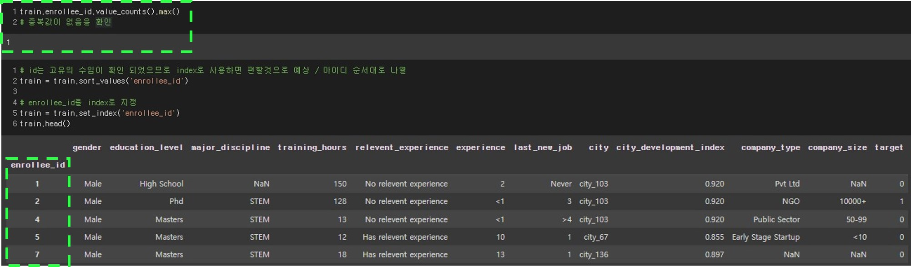 
**enrollee_id에 중복값이 없는것을 다시 확인하고, 식별용도로 사용하기 위해 index화**  

 

> **2) city, city_development_index**  
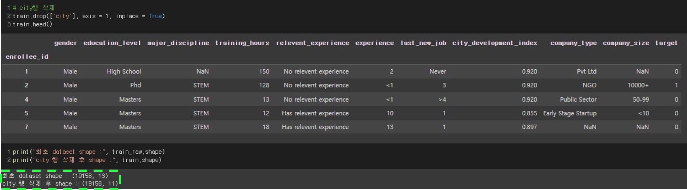 
**도시(city)는 코드형식으로 되어있으며, 도시개발지수(city_development_index)와 1:1 대응관계이기에 city행을 삭제   
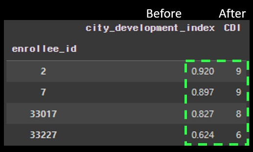 
도시개발지수(city_development_index)명을 CDI로 변경 및 이는 도시의 인프라를 나타내므로, 점수화가 가능할 것이란 판단 하 소숫점 둘째자리에서 반올림 후 0.1 단위로 등급 부여** 

 

> **3) gender**  
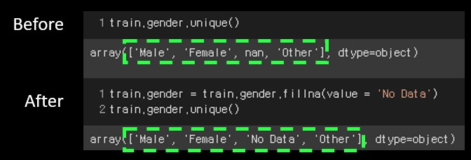 
**성별(gender)의 결측치를 'No Data'로 일괄대치** 

 

> **4) relevent_experience** 
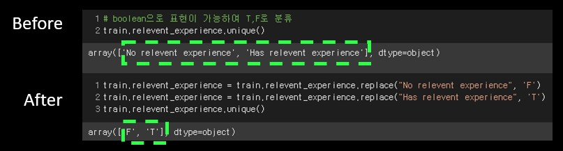 
**데이터직군 관련경험(relevent_experience)은 '경험 유무'이기에 boolean(T,F)으로 표기** 

 

> **5) education_level** 
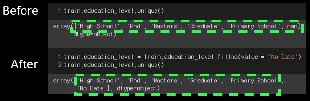 
**학력(education_level)에 대한 결측치를 'No Data'로 일괄대치** 

 

> **6) major_discipline** 
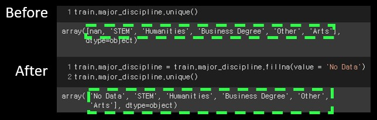 
**전공학문(major_discipline)에 대한 결측치를 'No Data로 일괄대치** 

 

> **7) experience** 
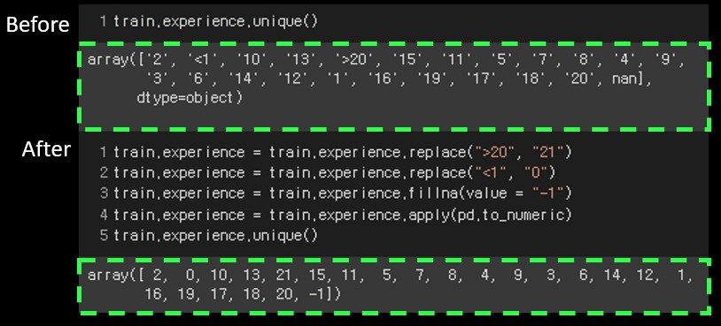 
**경력년수(experience)에 문자열로 존재하는 '<1'(1년 미만 경력)과 '>20'(20년 초과 경력)을 각각 0과 21로 치환**  
**결측치의 경우 연속형변수를 유지하며 0~21까지의 수와 차이를 두기 위해 -1이란 음수 값으로 대치** 

 

> **8) company_size** 
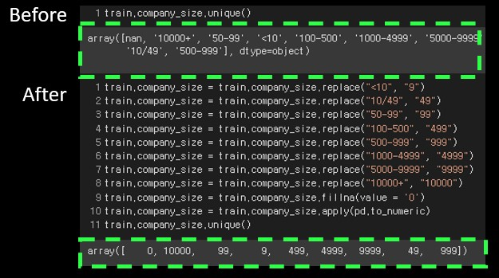 
**회사규모_사내 직원수(company_size)는 연속형 변수로, 이를 해치지 않는 숫자로 매핑을 실시하고, 결측치의 경우 0으로 대치** 

 

> **9) company_type** 
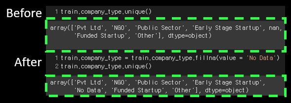 
**회사유형(company_type)에 대한 결측치를 'No Data로 일괄대치** 

 

> **10) last_new_job** 
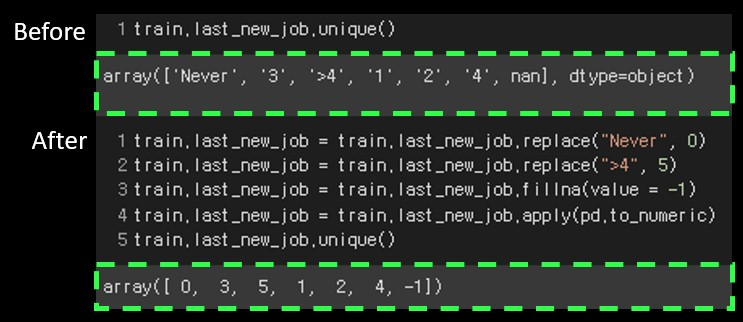 
**이전직장 근속년수(last_new_job)에 문자열로 존재하는 'Never'(이전직장 없음)과 '>4'(4년 이상 근속)을 각각 0과 5로 치환**  
**결측치의 경우 연속형변수를 유지하며 0~5까지의 수와 차이를 두기 위해 -1이란 음수값으로 대치** 

 

#### **1.3　레이블 인코딩**
모델학습시 object형식의 행을 처리하지 못하므로, 레이블 인코딩을 통해 숫자화 진행  
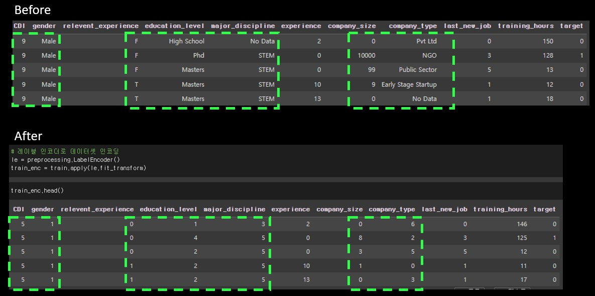 
**연속형임에도 값이 변경된 경우 중간값이 없기 때문에 큰값에 큰 label이 배정**  
ex) CDI  
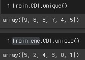 

 

### **2. 데이터 균형화 **
 

#### **2.1 데이터 분할**
> 머신러닝 모델에 사용할 학습데이터와 테스트데이터를 80% : 20% 비율로 분할  
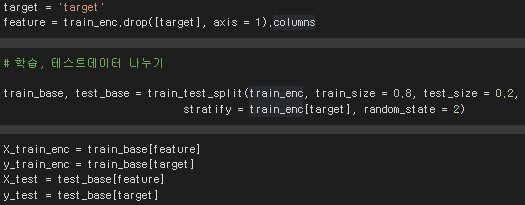  
**분할된 데이터 불균형 관측** 
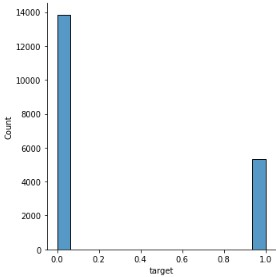 
**이직 비희망자(0)수와 이직 희망자(1) 수의 차이가 커 모델학습시 일반화가 어려울 수 있을 것으로 예상**
 

 

#### **2.2 Oversampling 기법 적용**
> 불균형한 데이터를 해소하기 데이터 증폭기법인 SMOTE적용  
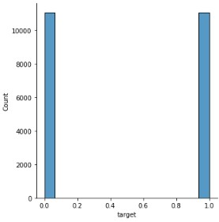 
**데이터 증폭 적용 후 시각화 결과 균형이 맞춰짐을 확인**
 

 

### **3. 이진분류 모델 설계 **
평가지표를 선정 및 이유 설명
 
#### **3.1 기준모델 정의**
> **1) Accracy BaseLine** 
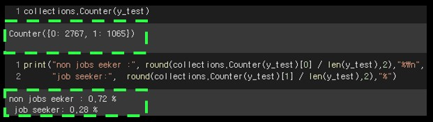 
target이 72:28 비율로 나타나는 기본 데이터셋은 모든 예측을 0(이직 비희망)으로 하더라도,  72%의 정확도가 나오기에 72% 이상의 정확도를 목표  

 

> **2) ROC AUC Score** 
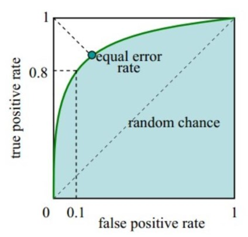 
퇴직자를 예측하는 문제가 주가 되므로, recall 점수가 예측에 사용될 수 있으나, 하나의 분석대상으로 수립한 예측모델을 다른 분석대상에 적용하면 정확도가 떨어질 수 있으므로, 두 분석 대상자(재직자, 퇴직자) 모두에 대해 좋은 예측력을 얻고자 ROC AUC Score를 평가지표로 도입 
**(예측모델이 recall과 specificity를 동시에 고려하여 정확히 분류 할 수 있도록 함)**  
**기준선이 되는 값은 없으나, ROC AUC Score가 우수한 모델을 선정할 계획**

 

#### **3.2 생성모델 성능 비교**
> － RandomForest모델과 XGBoost모델에 "Label Encoding을 적용하는데 그친 불균형 데이터", "SMOTE Oversampling까지 적용한 균형데이터" 를 각각 입력하여 총 네개 모델생성  
－ 모델학습시 과소,과대적합을 방지하고자 적정 parameter를 설정 및 통일하여 학습 실시 
(n_estimators = 100, max_depth = 5) 

 

> **1) 생성된 네개모델 성능 비교**  
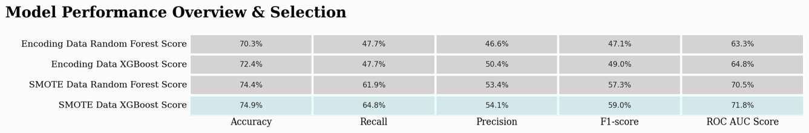 -Label Encoding만 거친 불균형 데이터로 학습을 진행한 RandomForest를 제외한 세 모델은 Accuracy BaseLine(72%)을 충족  - SMOTE를 활용하여 데이터 불균형을 해소한 뒤 학습한 모델의 성능이 상대적으로 우수  -SMOTE를 적용했을 때 RadomForest와 XGBoost 비교 결과 Accracy와 ROC AUC Score가 모두 높은 XGBoost에 대해 HyperParameter Tuning 실시. 

 

> **2) 하이퍼파라미터 튜닝 · 임계값 조절**  
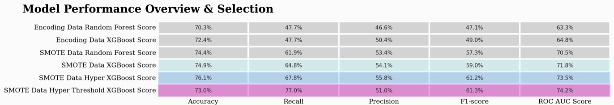 - **"HyperParameter Tuning을 진행한 XGBoost 모델"** 이 기존 **"SMOTE 데이터로 학습시킨 XGBoost"** 보다 Accracy, ROC AUC Score에서 향상  - 추가적으로 **"HyperParameter Tuning을 진행한 XGBoost 모델"** 의 **임계값(threshold)** 을 조절하였을때 Accracy는 감소하였으나 , ROC AUC Score가 향상  - 결과적으로 **"HyperParameter & Threshold Tuning XGBoost 모델"** 의 Accracy가 감소하였으나 여전히 Accracy BaseLine을 충족하고, 주제에 특화된 평가지표인 ROC AUC Score가 증가하였으므로, 해당 모델을 최종모델로 선정 

 

> **3) Confusion Matrix를 통해 상세값 확인**  
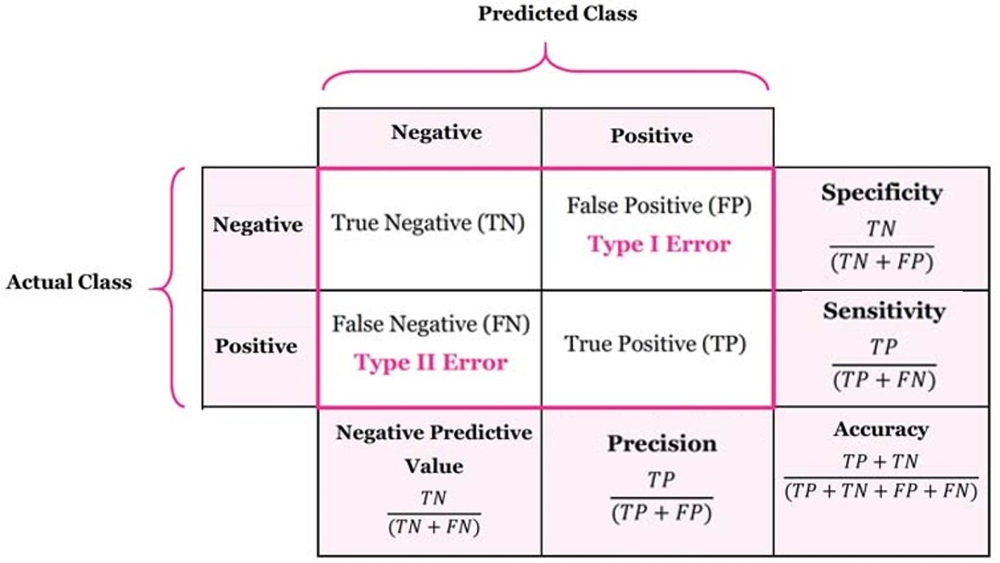 - 해당 도표를 기준으로 아래 분류결과를 확인시  
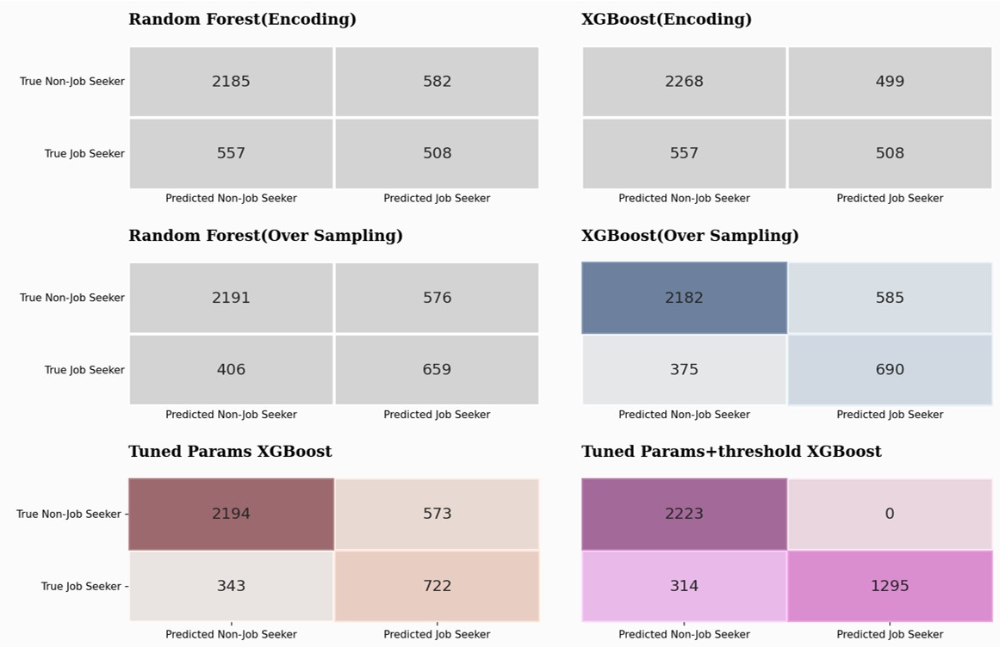 - **Tuned Params+threshold XGBoost** 모델의 TP부분이 확연히 증가한것을 볼 수 있었고, 이로인해 recall(sensitivity)값이 증가하고 1종오류가 발생하지 않는 것이 관측되었다.  - 또한, specificity값을 이루는 TN이 증가하고 FN이 감소하여 최종적으로 해당값이 증가함을 알 수 있다.  - 이러한 연관관계들로 ROC AUC Score가 가장 높게나옴을 파악할 수 있다.

 

### **4. 모델 분석 결과 **
> **1) 특성중요도 순위** 
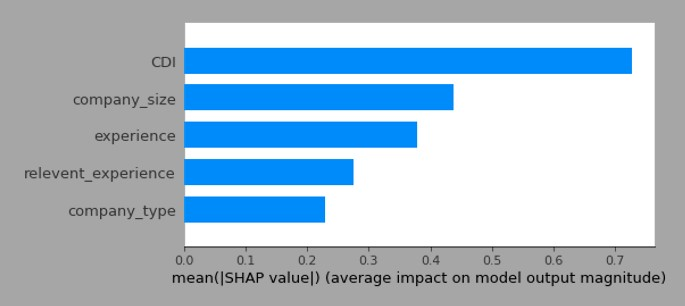 
－ 최종모델이 이직여부를 분류할때 참고한 주요 특성은 도시개발지수(CDI), 회사규모_회사에 종사중인 사원수(company_size), 경력년수(experience) 이하 순  
－ 최초 가설로 설정한 도시개발지수와 경력년수가 상위권에 위치함을 인지
 

> **2)이직희망여부에 대한 도시개발지수의 영향** 
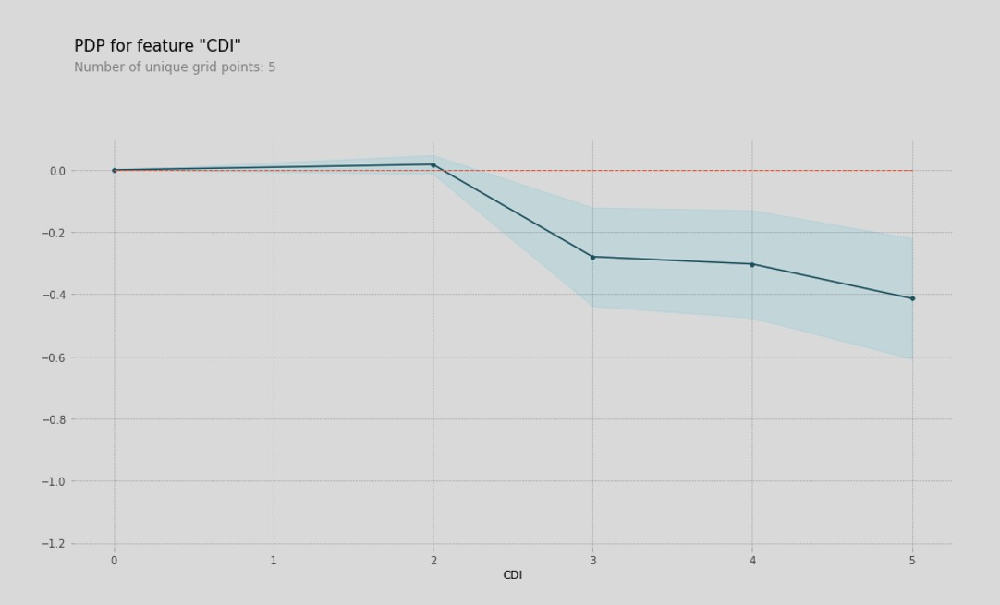 
－ 도시 개발지수가 0.6-0.7(CDI 2 이하)미만인 곳에 종사하는 사람들의 이직희망율이 양수의 영역에서 도식  
－ 반대로 0.7-0.8 이상(CDI 2 이상)의 개발지수를 보이는 도시에서 종사하는 사람들은 이직 희망율이 음수영역 진입 후 지속 감소  
－ 또한, 도시개발지수가 0.6미만(CDI 1)인 도시보다 0.6이상 0.7이하(CDI 2)인 도시에서 이직 희망율이 더 높은것을 보면, 0.7이상(CDI 2번 이상)의 도시에서부터 인프라가 크게 차이날것이라고 추측이 가능  
**도시개발지수가 낮을수록 이직률이 높다 : 참인 가설**

 

> **3)이직희망여부에 대한 근속년차의 영향** 
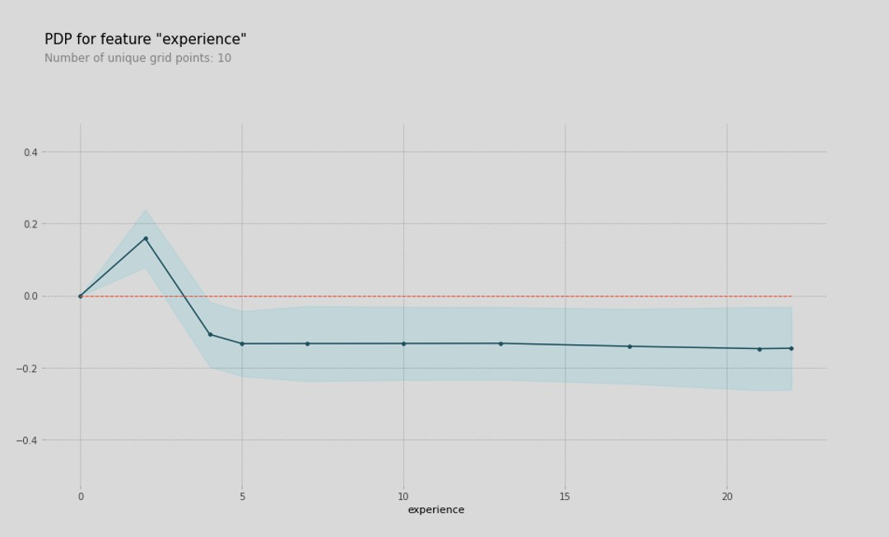 
－ 직종경험연차가 1년차부터 3년차까지 이직희망율이 비교적 높았으며(양수), 이후 감소(음수)  
－ 연차가 5년 이상일 경우 기울기의 큰 변화가 없으므로 이직자와 이직비희망자의 비율이 지속적으로 유사  
－ 이를통해 1-3년차의 주니어 분석가들의 이직률이 높고, 이후 안정추세를 찾아가는것으로 추측이 가능  
**직군 종사년차가 낮을수록 이직률이 높다 : 참인 가설**
